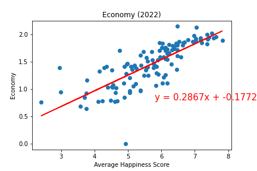

   

# Discovering the Best Places to Retire

Pulling data from the "World Happiness Report" from "kaggle", we will pull the top 5 countries to consider retiring to based on happiness levels considering six factors – economic production, social support, life expectancy, freedom, absence of corruption, and generosity. This project also considers pre-pandimc and post to output a forecast of the top 5 countries that retained their happiness ranks through one of the most difficult historic times.

## Acknowledgements

 - [Awesome Readme Templates](https://awesomeopensource.com/project/elangosundar/awesome-README-templates)
 - [Awesome README](https://github.com/matiassingers/awesome-readme)
 - [How to write a Good readme](https://bulldogjob.com/news/449-how-to-write-a-good-readme-for-your-github-project)
 - [kaggle](https://www.kaggle.com/datasets/unsdsn/world-happiness?resource=download (for 2015-2019 data years))

## FAQ

#### Question 1

What was the motivation?

#### Question 2

Why did we build this project?

#### Question 3

What problem does it solve?

#### Question 4

What did we learn?

#### Question 5

What makes the project standout?

# Contributing Factors Analysis

Economy

                                  

Social

                            

Life Expectancy

.png 

Freedom

Corruption

Generosity

